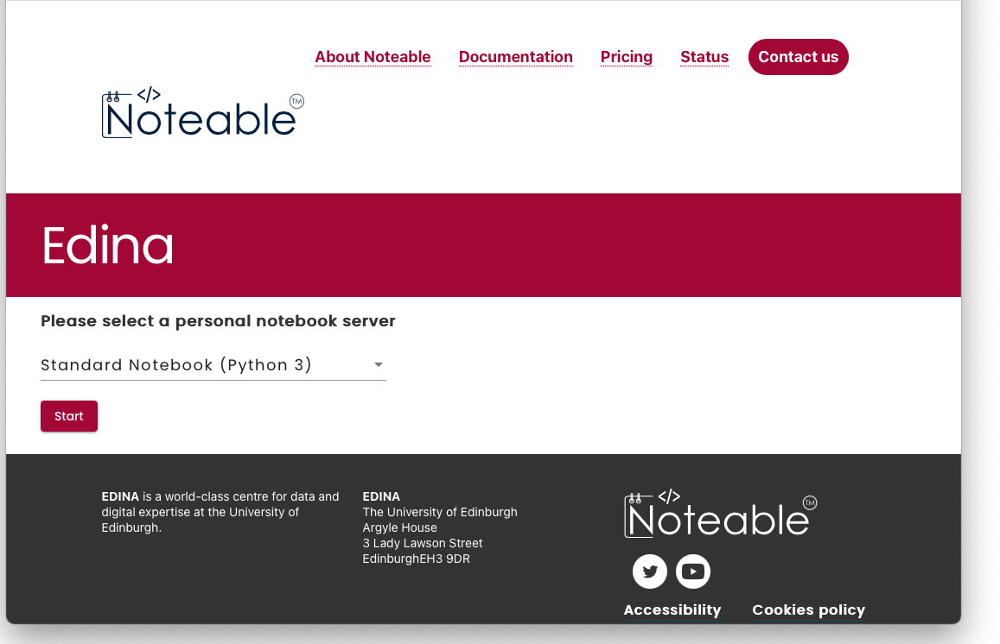
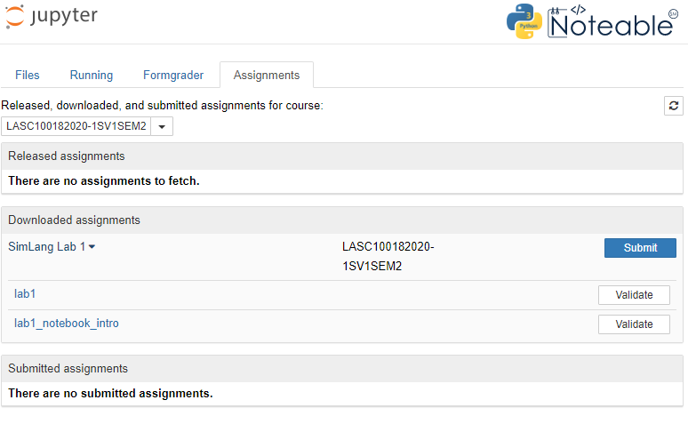

# The plan for week 2 labs

In this first lab we'll show you how to access the noteable server to work on code, how to import code from github to noteable, and then by working through the first notebook you'll learn the basics of python. If that all sounds a bit complicated, don't worry, it's fairly simple and we'll talk you through  it step by step here. And if you can't get it to work or have questions, we are available to help you in the drop-in labs on Teams.

# Logging on to noteable

All the coding for this course will be done using interactive Python notebooks, which allow us to combine text and code in a single document. The interactive Python notebooks work using a "Jupyter Server". The University of Edinburgh provides one that you can log into, and we will be accessing it **via Learn**.
To do that:

1. Go to the Simulating Language page on [Learn](http://www.learn.ed.ac.uk/)
2. Click on the 'Course Materials' tab on the left
3. Click on the **Notable** link at the bottom (If you're logged into Learn already, you can try [this link](https://www.learn.ed.ac.uk/webapps/osc-BasicLTI-BB5d1b15b77a8ac/tool.jsp?course_id=_79953_1&content_id=_5614494_1) to go there directly).
4. Once you've logged on to the noteable service you may have to either "reconnect" or "start" your server (if there is a list of options available, stay with "Standard Notebook (Python 3)").
    
5. Once you've started and connected/reconnected to the server you'll be given an interface that will let you upload notebooks and navigate the files you'll be creating.
6. There are four tabs at the top of the screen. Click on the one called 'Assignments'.
7. In the top box, called 'Released assignments', you should see *SimLang Lab 1*: click on the 'fetch' button next to it
8. You should now see something like the image below.

# Programming tasks for today's lab

You will now see several notebook files (files whose name ends in ".ipynb"). The main part of today's lab is the file lab1.ipynb - open that file by clicking on it, it'll open up a new noteable window containing more explanatory text that you can work through. Your main task for labs this week is to work through that notebook! If you need help you can come to drop-in labs on Teams and get one-on-one help, but we have also made some extra notebooks available which will provide you some extra help:
- lab1_notebook_intro.pynb is a brief introduction to notebooks, and showcases some of the nice stuff you can do with formatting text etc.
- lab1_answered.ipynb (when released) provides a model answer for the lab1 notebook - we have completed the code cells for you so you can see what we were expecting you to do.
- lab1_walkthrough.ipynb (when released) provides a very detailed explanation of the logic behind the model answers for the "Functions" section of the notebook.

# Re-use

This page was written by Kenny Smith, based on https://github.com/smkirby/SimLang/blob/master/README.md, written by Simon Kirby. All aspects of this work are licensed under a [Creative Commons Attribution 4.0 International License](http://creativecommons.org/licenses/by/4.0/).
