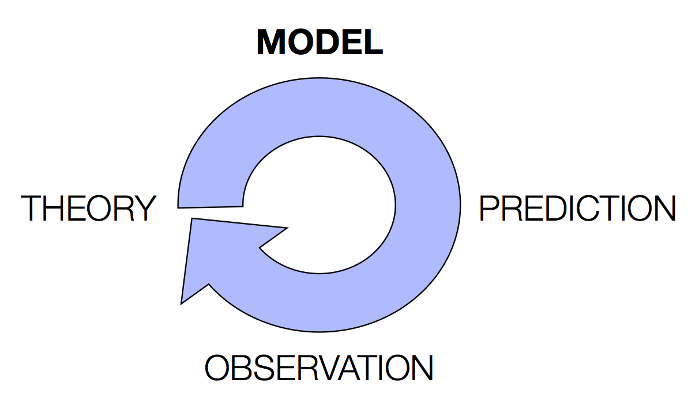

This is a pre-lecture reading - do it before the lecture, I'll assume you have.

This is the opening week of the course - welcome aboard! In this course we are going to be using simulation models to study language. While people use models in linguistics for a number of purposes, we are going to focus on how processes of learning and evolution shape linguistic systems. In the first part of this reading we'll introduce some basic concepts in modelling. What is a model? What is a simulation model? How can you build a model of a linguistic system? Then in the lecture we'll focus on the kinds of models we'll be using in this course: we'll explain why this kind of modelling is particularly useful when you are interested in learning and evolution of language, and we'll introduce the basic modelling framework we’ll be using for the rest of the course (Bayesian learning). And in the practical we'll introduce you to python, which is the programming language we'll be using to build our models. But the starting point is to understand models: what they are, and what you can use them for.

# What is a model, and why build one?

## What is a model?

A model is a miniature version of the system you are interested in. A model is typically much simpler than the real-world system you care about, because that makes them easier to build, easier to play with, and ultimately easier to understand.

### A physical model

We will be building models of language, learning and evolution, but people use models in all kinds of domains. One of my favourite kinds of model (just because they are pretty) is a wave model – here’s a video of a beautifully simple wave model in a tank (NB this guy with the wave tank is *not* me, although he actually is/was at Edinburgh).

<iframe width="560" height="315" src="https://www.youtube.com/embed/-m_VDE-BSgc" frameborder="0" allow="accelerometer; autoplay; clipboard-write; encrypted-media; gyroscope; picture-in-picture" allowfullscreen></iframe>

Notice a couple of features of the model.

Firstly, it’s small and simple. It’s on a much smaller scale than the waves you get in the North Sea. The model sea bed is really simple (smooth surfaces, nice steady slopes – no shingle, no complex coastlines, no shipwrecks). And the water itself is even relatively simple  – I bet it’s all approximately the same temperature, unlike the real sea, which is warmer near the surface.

Secondly, the model gives the guy with the microphone amazing control. If he wants to look at choppy waves, he turns the dial one way. If he wants to look at gentle waves, he uses another setting. The real world doesn’t work like that, and some events he might be interested in (e.g. really steep waves) might be very rare or occur unpredictably in the wild, which makes them hard to study.

Thirdly, he can get a really really good look at what is going on inside the waves – he can easily observe stuff (like what the water is doing inside each wave, or the shape of the waves as they shoal) that would be much harder to do in the real world. He could, if he wanted, easily measure all these properties in his model system, which would be hard in the wild.

So he gains a lot by having this model of a wave. There are tradeoffs though – he also loses some things by working with this model, rather than studying real waves out in the wild. Have a think about what he loses in this case, and as we go through the course think about what we are losing with the models we work with.

### Simulation models

Sadly, we aren’t going to be using wave models, because 1) they look kind of expensive, 2) I can't fit one in my spare room (which is doing double duty as my office in corona times), and 3) this is a course about language, not waves. We also aren’t going to be using physical models, because they really aren’t that suitable to the kinds of things we want to model (although see an example below where a physical model would be appropriate!). Instead, we are going to be using computer simulations.

The idea behind computer models is the same as for physical models: we want a simple version of the system of interest, that resembles it in important respects, that we have a high degree of control over, and that makes it really easy to measure the things we care about. However, building a computer model involves a different kind of work than building a physical model. The wave tank model is essentially the real thing in miniature: it’s a small amount of water sloshing about in a tank. And it works in the same way as the real thing because the laws of physics are the same as for the real thing – all we have to do is make a nice perspex tank, put some water in it and we have a wave model (more or less), since the world takes care of all the complex stuff for us, like how water molecules move, how they bump into each other, how they react when they hit a slope or a barrier, etc.

In contrast, in a computer model, we have to tell the computer how to work out all those things. If you wanted to replace the wave tank with a simulation model, you’d have to write a computer program which describes how water moves. This will be a simplified description: rather than describing what all the individual water molecules do at any point in time, it’ll have some general principles built in to it, like "water flows downwards", "water flows round hard obstacles and can smash lighter ones", etc (those descriptions won’t be informal English descriptions of course, but really precise descriptions written in a language the computer can work with). But once that description was written in enough detail, the computer could work out what will happen from any given position: so you tell the computer "OK, start with a huge wave 1 mile offshore, and see what happens if water does what water does", then the computer just mechanically follows the description it has been given and works out where the water will be after 1 minute, 2 minutes, 3 minutes, etc.

Have a little think about what kind of stuff you would include in a computer model of a wave if you were building it, and what kind of stuff you would leave out. Is everything important? Are the same things always important no matter what you want to use the model for?

We will be building and working with computer models in this class. We will be working with computer programs which specify how (simple!) languages work and how the processes we are interested in (learning and evolution) work, we will specify some starting conditions, and then we will have the computer run from there and figure out what happens over time, according to our rules.

## What is a model for?

There are two main ways you can use a model: to work out in a very precise way the predictions of a theory, or to understand how a real-world system works by understanding how a model version works. These two approaches are related, and differ mainly in emphasis I think.

### Models as a tool for testing predictions of a theory

Let’s imagine a different example, that actually relates to language rather than water. Suppose you have a theory, say that specifies how linguistic variants diffuse over a social network. You think your theory makes a certain prediction, say that some sound changes are possible but others are impossible, or that some social groups will always lead changes whereas others will follow. It would be nice to look at real world language change and see if it matches this prediction, but first we better check exactly what our theory actually predicts – it would be embarrassing if we thought we understood the predictions of our theory but in fact made a mistake.

One way to see what a theory predicts is just think about it *really* carefully, check your theory makes the correct predictions about the world, and then try to describe to other people why it makes the right predictions. That might convince you, but it’s unlikely to convince a sceptic – what if they just disagree with your intuitions about how things will work out? Instead of building a verbal model or running a thought experiment, a computer modeller would build a computational model of the theory: they would turn the theory into a formal description that a computer could use (so they would tell the computer: variants spread like this but not like that, social networks look like this, let’s start with a social network where the interesting variant is here and everyone else sounds like this, etc), then they would have the computer run the model. The computer slavishly follows the description that the modeller put in, which is based as faithfully as possible on the theory, and the modeller watches to see what happens – does the mechanically-derived series of events match her verbal prediction? If so, congratulations – you are very clever. But if not, why not? Is there something important missing from the theory, and therefore from the model? Is there something weird about the way the model was built, that isn’t actually faithful to the theory? Either way, the predictions of the theory are now nice and clear – a critic might argue that the model doesn’t really match the theory, but they can’t argue with the mechanically-derived predictions that the model produces, because the computer isn’t relying on imagination or intuition to figure out what happens next. The computer just slavishly following the rules, following what the theory says. Then once we have this nice precise, defensible set of predictions, we can go to the real world and see if things really work out in the same way as our theory (via the model) predicts. If they do, hurrah. If they don’t, maybe we can go back to our theory, tweak it some, tweak the model, and go round the whole cycle again.

To make this a bit more concrete, here’s a real example to do with vowel inventories and a very simple model (actually, a linguistically-interesting model that could be built using a tank of water – awesome).

Vowels can be thought of as existing in a two dimensional space. This is how they are represented in the IPA for example:

The dimensions of this representation correspond roughly to the position of the highest point of the tongue in the mouth when the vowel is produced; they also map fairly straightforwardly to the first and second formants of the acoustic spectrum of the vowel sound.

If you look at the distribution of vowels in the world’s languages only some patterns arise. For example, you never find a language in which the only three vowels are /i/, /e/, and /y/, i.e. where all the vowels in the language are grouped in the same region of articulatory and acoustic space. Rather, the vowel space tends to be filled symmetrically, such that they are distributed widely in the space rather than being all clustered in one corner. As a scientist studying language, we might spot this kind of pattern and look for an explanation. A reasonable theory might be something like: *vowels tend to avoid being close to each other in order to maintain perceptual distinctiveness*.

So, how do we tell if this theory is correct? It might not be immediately obvious what predictions this theory makes. And without predictions we can’t test the theory against the real data and compare it to other competing theories (actually, in this case, perhaps you do think it’s obvious, but let’s go along with this example for now and return to that in a moment!). If the predictions a theory makes are not immediately obvious, then this is where we need a model – something like the wave tank.

[Liljencrants and Lindblom (1972)](https://www.jstor.org/stable/411991#metadata_info_tab_contents) did just that and built a model of the vowel space, and it is similar in many ways to the wave tank model! In their paper they point out that under the "maintain perceptual distinctiveness" theory vowels can be modelled as magnets attached to corks floating in water: if the magnets are set up to repel each other than the floating "vowels" will eventually organise themselves in such a way to maximise their distance from each other. Rather than get their hands wet with an actual tank of water, Liljencrants and Lindblom were able to use some maths (borrowed from physicists studying how repulsion works) to model this magnets-on-corks scenario computationally. In particular, they could use this model to see what kinds of vowel systems are predicted by the "maintain perceptual distinctiveness" theory for 3 vowel systems, 4 vowel systems, 5 vowels, all the way up to 12 vowel systems (returning to the point above: you might be confident you can guess without any help from the model for 3 vowels just by looking at the space, but do you *really* trust your intuitions for 12 vowels?). In this way, they constructed a model based on the theory that vowels maximise distinctiveness and compared the vowel systems generated by this model to real-world cross-linguistic data on vowel systems – you can look at the paper to see how accurate the theory’s predictions were (they provide the predictions, attested natural systems, and a summary on page 854 of the paper), but the predictions seem surprisingly good.

### Models as a tool for understanding by playing

That’s how you might use a model to link theory to predictions. Another way of thinking about models (which I am keen on, and which Sigmund advocates in the possible follow-up reading I mention below) is that building models and playing with them can give you important *insights* into the real world: by understanding the processes in the model, you can understand the real thing. As I discussed with the wave machine, models make it easy to play with a system – you can turn the dials in different ways, and see what happens. With computational models, you can easily try out counterfactuals (what if water flowed uphill sometimes?), or add extra ingredients to the system (what do breakwaters and bottlenecks do to the shoaling behaviour of a wave?). Some of this might be very focussed, hypothesis-driven probing of the model. But some of it might be purely speculative – let’s try this and see what happens, I wonder what would happen if we did that. This kind of model play might not link directly to the real world, but it might never the less be useful: if it gives you, the modeller, a better feeling for how the model system can work, maybe you will start to get some useful insights into how things work in the real world. I like Sigmund’s take on this: "Predictions are not the pinnacle of science.  They are useful, especially for falsifying theories.  However, predicting can’t be a model’s only purpose. … surely the *insights* offered by a model are at least as important as its *predictions*: they help in understanding things by playing with them." (Sigmund, 1995, p. 4). That might sound much vaguer than the theory-model-predicition cycle I mentioned first, and it is! We will be doing lots of playing with models on this course, and maybe a bit of theory-testing – keep that contrast on a mental back-burner, and at the end of the course, decide for yourself which approach you think is most productive.

## A quick word on mathematical modelling

All of the above referred to physical models and computational models, or simulation models. Probably the main technique actually used in the sciences is mathematical modelling – same idea as simulation modelling, but rather than writing down a computer program to build your model, you write down some equations, and then work out the predictions of the model using fancy maths. We won’t be doing any of that in this course, because I’m not a mathematician, and probably neither are most of you. You will catch sight of a few equations though. The key thing is not to panic. You’ll see a very simple equation immediately in the first lecture when we introduce Bayes’ Rule. And when you are doing readings for the course you will often find that people describe computational models using little bits of maths (because it’s nice and concise and precise) – in most of the papers we will be looking at, this doesn’t happen much, or if it does the maths will be explained in words as well, and none of it is more complicated than a bit of multiplication and division. And remember that all our models will be done in simulation on computers – you won’t be proving theorems, or even doing any multiplication or division by hand, we’ll just be hitting "play" on the computer and letting it take the strain.

## Optional additional readings on the general topic of modelling

If you want a fairly accessible popular science intro to modelling you could read [chapters 1 and 2 of Sigmund (1995)](https://ebookcentral.proquest.com/lib/ed/detail.action?docID=4981606) – the whole book is available via the library as an ebook. Karl Sigmund builds mathematical models of evolution. This book is an introduction to the kind of work he does, talking about how mathematical models can help you understand various evolutionary processes (e.g. the evolution of sex ratios, or the evolution of cooperation). Like I just said, we aren’t actually going to be doing any maths in this course, but this reading is worthwhile. In Chapter 1, Sigmund talks about gaining insights into complex real-world phenomena by playing with simple models – that’s what we’ll be doing in this course. In Chapter 2 he describes a really simple model of life, called Life, which nicely illustrates a couple of features that all good models have in common. In particular, Life is incredibly simple – just two rules – but generates some really complex and interesting behaviours. If you find Life a bit dry based on Sigmund’s description of it, then you can read [a Guardian article](https://www.theguardian.com/science/alexs-adventures-in-numberland/2014/dec/15/the-game-of-life-a-beginners-guide) on it. And you should absolutely [play with it yourself](http://pmav.eu/stuff/javascript-game-of-life-v3.1.1/?autoplay=0&trail=0&grid=1&colors=1&zoom=1&s=random) – you can use that online simulator to test out some of the patterns Sigmund talks about, or just start from a random set of cells and see what happens. And there are tons of great videos of complex Life stuff online – personally I like [this really dramatic one](https://www.youtube.com/watch?v=C2vgICfQawE&t=1m10s).

You could also/instead check out [Servedio et al. (2014)](https://journals.plos.org/plosbiology/article?id=10.1371/journal.pbio.1002017), which discusses the role of (mathematical) models in evolutionary biology. Again, we won’t be doing mathematical models and we are linguists not biologists, but their discussion of "proof-of-concept" models as a means of testing verbal theories is interesting and relevant.

# References

[Liljencrants, J., & Lindblom, B. (1972). Numerical simulation of vowel quality systems: The role of perceptual contrast. *Language, 48,* 839-862.](https://www.jstor.org/stable/411991#metadata_info_tab_contents)

[Servedio, M. R., Brandvain, Y., Dhole, S., Fitzpatrick, C. L., Goldberg, E. E., Stern,  C. A., Van Cleeve, D., & Yeh, D. J. (2014). Not Just a Theory - The Utility of Mathematical Models in Evolutionary Biology. *PLoS Biology, 12,* e1002017.](https://journals.plos.org/plosbiology/article?id=10.1371/journal.pbio.1002017)

[Sigmund, K. (1995). *Games of Life: Explorations in Ecology, Evolution and Behaviour*. London: Penguin.](https://ebookcentral.proquest.com/lib/ed/detail.action?docID=4981606)

# Re-use

This page was written by Kenny Smith; the Liljencrants and Lindblom example is from https://github.com/smkirby/SimLang/blob/master/simlang_1_lecture.ipynb, written by Simon Kirby. All aspects of this work are licensed under a [Creative Commons Attribution 4.0 International License](http://creativecommons.org/licenses/by/4.0/).
